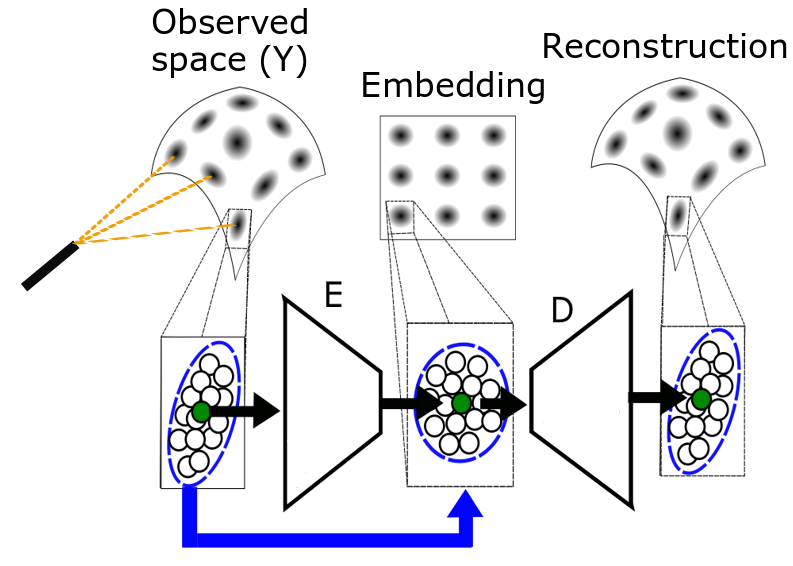
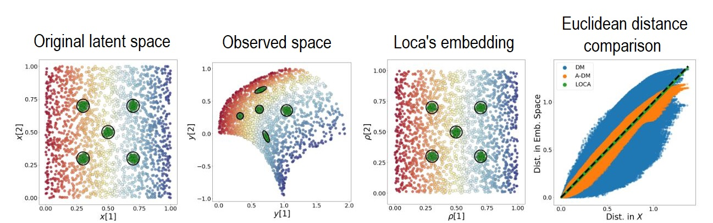

<p float="left">
  
   
</p>

LOCA is an algorithm for extracting canonical data coordinates from scientific measurements. It produces a nonlinear embedding that is approximately isometric to the unknown latent manifold structure of the data. Loca assumes a specific, broadly applicable stochastic sampling strategy, and successfully corrects for unknown measurement device deformations. 


## Instalation
1. git clone
2. python setup.py install --user

## Input
### Neural network settings
1. sigma: The standard deviation of the bursts in the embedding domain.
2. encoder_layers: A list containing all the layers in the encoder's neural network, including the input and output layer.
3. decoder_layers: A list containing all the layers in the decoders's neural network, including the input and output layer.
4. activation_enc: The activation type that will be used in the encoder's neural network.
5. activation_dec(Optional): The activation type that will be used in the decoder (If not defined activation_enc will be used).


### Training settings
1. train_data -  n x m x d matrix, where n is the amount of bursts, m is the number of points in each burst, and d is the ambient dimension of the data.
2. Epochs: Number of epochs.
3. lr - Learning rate.
4. batch_size(Optional) - The batch size that will be used for the GD. If not given, the whole data will serve as a single batch.
5. val_data(Optional) - Same as in train_data but for validation (the values of m and d of this tensor should be the same as in train_data).
6. evaluate_every(Optional) - Int. The amount of epochs that will be passed between the evaluation of the losses based on the training data (AdditionalDataY) and validation data (AdditionalDataY_val) if is given.
7. verbose(Optional): Boolean - Enables the printing of the losses evaluated evalutate_every epochs.
8. early_stopping (Optional): Boolean. An early stopping mechanism that will stop the training if the sum of the two Loca losses won't get better in the last 2000 epohcs. If AdditionalDataY_val will be supplied then the loss will be calculated based on it, otherwise it will be based on AdditionalDataY. The mechanism will evaluate the loss every evaluate_every epochs.
9. train_only_decoder(Optional): Boolean. If True the training will only apply optimize the reconstruction loss, and will update only the weights in the decoder.

## Implementation details
1. The last layer in the encoder and decoder will use the identity actiavtion function, no matter what was defined in the Training settings.


## TODO:
1. Generate setup.py for installing the different packages used by loca


## Welcome 

You can use the [editor on GitHub](https://github.com/Manuel83/sample/edit/master/index.md) to maintain and preview the content for your website in Markdown files.

Whenever you commit to this repository, GitHub Pages will run [Jekyll](https://jekyllrb.com/) to rebuild the pages in your site, from the content in your Markdown files.

### Markdown

Markdown is a lightweight and easy-to-use syntax for styling your writing. It includes conventions for

```markdown
Syntax highlighted code block

# Header 1
## Header 2
### Header 3

- Bulleted
- List

1. Numbered
2. List

**Bold** and _Italic_ and `Code` text

[Link](url) and 
```

For more details see [GitHub Flavored Markdown](https://guides.github.com/features/mastering-markdown/).

### Jekyll Themes

Your Pages site will use the layout and styles from the Jekyll theme you have selected in your [repository settings](https://github.com/Manuel83/sample/settings). The name of this theme is saved in the Jekyll `_config.yml` configuration file.

### Support or Contact

Having trouble with Pages? Check out our [documentation](https://help.github.com/categories/github-pages-basics/) or [contact support](https://github.com/contact) and we’ll help you sort it out.

